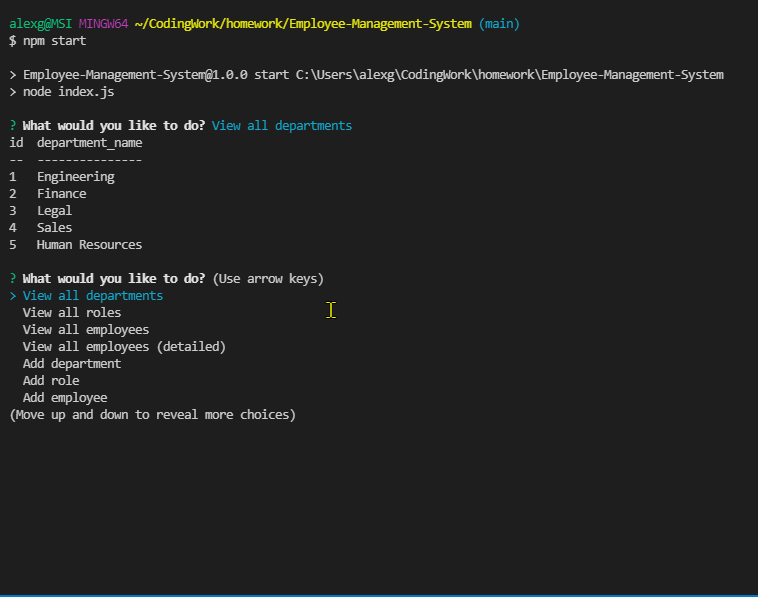

# Employee-Management-System
  -----------------

## Table of Contents
  - [Description](#Description)
  - [Installation Instructions and Getting Started](#Installation)
  - [Built With](#Built)
  - [Technologies Used](#Technologies)
  - [Authors](#Authors)
  - [Acknowledgments](#Acknowledgments)

## Description
Still writing your employee records on clay tablets in cuneiform? Try out this Employee Management system instead! This is MySQL based management system with add, view, update, and delete capabilities for employees, roles, and departments.

**[Click this link WATCH the Employee Management System in action]()**

  

## Installation Instructions and Getting Started
Node.js, Inquirer, MySQL2, and Console.table all need to be installed. 

Startup Instructions
1) To start the application, navigate in a command console to the "db" folder that houses schema.sql. Enter in 'mysql -u root -p' and enter in your password. This will start up a MySQL instance. Then, enter into console 'source schema.sql', hit enter, and then 'source seeds.sql' and press enter again.

2) Navigate to the folder that houses index.js and enter in 'node index.js'. You are now ready to begin.

## Built With
* [JavaScript](https://developer.mozilla.org/en-US/docs/Web/JavaScript)
* [Node.js](https://nodejs.org/en/)
* [MySQL](https://jestjs.io/) 
* [Inquirer](https://www.npmjs.com/package/inquirer) 
* [Console.table](https://www.npmjs.com/package/console.table)
* [MySQL2](https://www.npmjs.com/package/mysql2)

## Technologies Used
* [Microsoft Visual Studio Code](https://code.visualstudio.com/)
* [Git Bash](https://git-scm.com/downloads)
* [GitHub](https://github.com/)

## Practices Used
* Agile style User Story and Acceptance Criteria.

## Authors
**Alexander Gibson** 

- [Link to Alex's Portfolio Site](https://argibson02.github.io/Professional-Portfolio-2/)
- [Link to Alex's Github](https://github.com/argibson02)
- [Link to Alex's LinkedIn](www.linkedin.com/in/alexander-gibson-1b0bb6105)

## Acknowledgments 😊
- Thanks to Jerome, Manuel, Cheng, and Daniel for instructing the UCB Coding Bootcamp.

